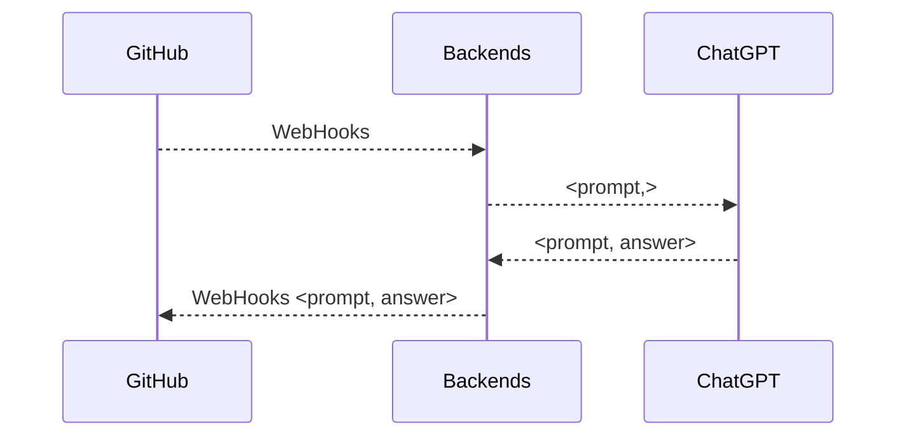

# ChatGPT-ProBot

Development ChatGPT-ProBot in 5 mins~

<div grid="~ cols-2 gap-4">
<div>

```js
const { search } = require('./src/client.js')
const commands = require('probot-commands-pro')
module.exports = (app) => {
  commands(app, 'chatgpt', async (context) => {
    if (context.isBot)
      return
    const { comment, issue, sender } = context.payload
    const { body } = comment || issue
    const prompt = body.replace('/chatgpt', '').trim()
    const response = await search(prompt)
    const issueComment = context.issue({
      body: `@${sender.login} 🤖️: ${response}`,
    })
    return await context.octokit.issues.createComment(issueComment)
  })
};
```
</div>
<div>


<br/>
<br/>

> Backends 选择的是 Vercel Function。


</div>

</div>

