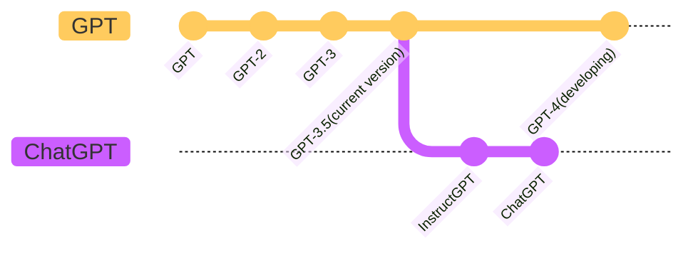

# GPT系列

<!-- 
Improving Language Understanding by Generative Pre-Training
Language Models are Unsupervised Multitask Learners
Language Models are Few-Shot Learners
-->

| Name | Paper                                                                                                                                                  | Code                                                          | Time         | Parameters | Training Size |
| ---- | ------------------------------------------------------------------------------------------------------------------------------------------------------ | ------------------------------------------------------------- | ------------ | ---------- | ------------- |
| GPT  | <Button title="Paper" url="https://s3-us-west-2.amazonaws.com/openai-assets/research-covers/language-unsupervised/language_understanding_paper.pdf" /> | NULL                                                          | 2018 年 6 月 | 1.17 亿    | 约 5GB        |
| GPT2 | <Button title="Paper" url="https://d4mucfpksywv.cloudfront.net/better-language-models/language-models.pdf" />                                          | <Button title="CODE" url="https://github.com/openai/gpt-2" /> | 2019 年 2 月 | 15 亿      | 40GB          |
| GPT3 | <Button title="Paper" url="https://d4mucfpksywv.cloudfront.net/better-language-models/language-models.pdf" />                                          | <Button title="CODE" url="https://github.com/openai/gpt-3" /> | 2020 年 5 月 | 1,750 亿   | 45TB          |

<!-- 需要聊ChatGPt 首先要聊的是 OpenAI 最重要的工作 GPT 系列。
整个GPT系列目前演进三个版本，分别是GPT1到3。
我们可以看到三个版本在数据、参数规模上都有很恐怖的增长。同样的其效果几乎几年就颠覆大家对该系列模型的认知。
我们今天讨论的ChatGPt 来自目前正在迭代的GPT-3版本，并且引入了新的训练方法。
我们先来看看GPT系列的发展历程。
 -->
