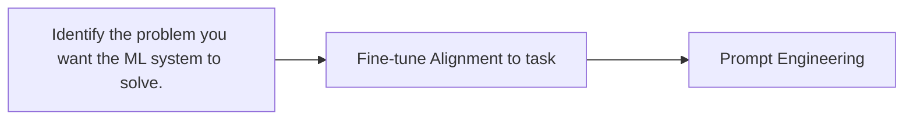
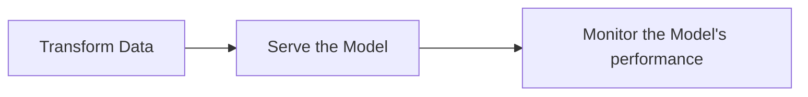

# LLM + DevOps

Fundation Models MLOps = <del>Data Engineering</del> + Model Engineering + Prompt Engineering + DevOps

ChatGPT = LLM(fundation models) Train + Fine-tune(Optional) + Prompt Engineering + DevOps

以 ChatGPT 为例子的 LLM 开发下游任务流程中不再 train from scratch，而是从 pre-trained model 开始，可选少量的Finetune(Alignment到问答任务) + 设计 domain 相关的 Prompt + DevOps。

 

Experimental phase

Production phase

<!--
在一个下游任务上，比如说开发式QA聊天机器人。
当大模型+很少甚至不finetune效果大于一个精心设计数据/模型的小模型时，可以说不需要做数据工程这一步骤了，或者说数据工程被替换为 在开发LLM大模型阶段和在Model EngineeringFine-tune阶段的下游任务对齐。
-->
