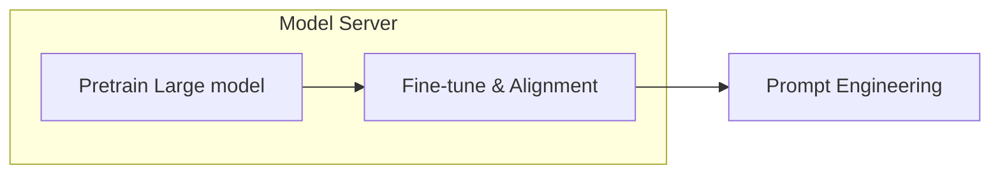

<b>Unsupervised Pre-train</b>

Large Language Model. Training phase: given tokens $\mathcal{U}$ and model $\Theta$ to predict $u_i$:

$$
L(\mathcal{U})=\sum_{i} \log P\left(u_i \mid u_{i-k}, \ldots, u_{i-1} ; \Theta\right)
$$

For GPT, $\Theta$ is Transformer decoder.
$$
\begin{aligned}
h_0 & =U W_e+W_p \\ h_l & =\operatorname{Transformer} \left(h_{l-1}\right) \forall i \in[1, n] \\

P(u) & =\operatorname{softmax}\left(h_n W_e^T\right)
\end{aligned}
$$

$W_e$: word embeding，$W_p$: position embeding.

<b>Task Alignment</b>

- **GitHub Copolit**. Task: text2code, Power By [Codex](https://openai.com/blog/codex-apps).
- ChatGPT. Task: text2text, Power By [InstructGPT](https://arxiv.org/abs/2203.02155).

  

    GPT
  

  

    Alignment
    <carbon:arrow-right class="inline"/>
  

  

  <!-- <AICard title="DALL-E" img="/dalle.jpg" url="https://openai.com/dall-e-2/"/> -->
  <!-- <AICard title="Whisper" img="/whisper.jpg" url="https://openai.com/blog/whisper/" /> -->
  <AICard self-center img="/Copilot.webp" url="https://openai.com/blog/codex-apps/" />
  <!-- <AICard self-center title="ChatGPT" img="/chatgpt.jpg" url="https://openai.com/blog/chatgpt/" /> -->
  

