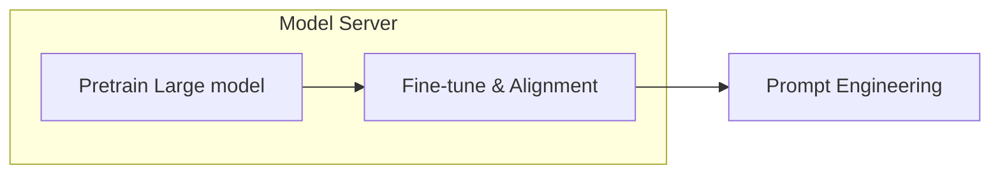

  

  <AICard title="GPT" img="/gpt.jpeg" url="https://openai.com/" />
  
    <carbon:arrow-right class="inline"/>
  
  

  

  <AICard title="DALL-E" img="/dalle.jpg" url="https://openai.com/dall-e-2/"/>
  <AICard title="Whisper" img="/whisper.jpg" url="https://openai.com/blog/whisper/" />
  <AICard self-center title="CodeX" img="/Copilot.webp" url="https://openai.com/blog/codex-apps/" />
  <AICard self-center title="ChatGPT" img="/chatgpt.jpg" url="https://openai.com/blog/chatgpt/" />
  

<!--
以下几个产品可能或多或少我们都可能听说过甚至是接触过。
例如text2img 文本作画任务 DALL-E.
文本和图像的多模态预训练算法 clip
最近开源的语音识别模型 Whisper
我们所熟知、由Github 合作开发的代码补全工具 copolit。（主要是基于GPT-3的）
openai 是一家来自硅谷的人工智能独角兽公司，其关注 AGI 研究，若干大规模预训练模型产品的研发引发了很多关注。
我们今天的主题产品ChatGPT也产自OpenAI。

其实准确来说 DALL-E CLIP Whisper ChatGPT 都是 GPT-3的微调版本
🔹DALL-E: creating images from text
🔹CLIP: connecting text and images 文本和图像的多模态预训练算法
🔹Whisper: multi-lingual voice to text
🔹ChatGPT: chatbot, article writer, code writer

- GPT-1 和 Bert 开启了大规模预训练模型在 NLP 的广泛应用，主要范式是 Pretrain + task finetune。
- GPT-2 通过堆砌参数到十亿级别暴力出奇迹，在数据集和模型规模更大的情况下达到了不需要根据下游任务再做 finetune。
- GPT-3 贯彻执行到底，参数来到了恐怖的千亿级别，训练一次成本数百万美元，甚至已经没办法做 finetune。在下游任务 few-shot/zero-shot/one-shot 性能上部分甚至超过了有监督的 SOTA。
-->
